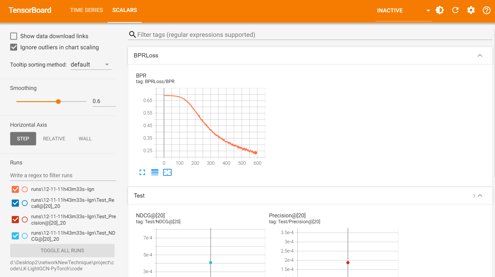

## 环境配置

### 1. 创建conda环境

```bash
conda create -n lightgcn python=3.7
conda activate lightgcn
```

### 2. 安装依赖

进入到当前文件夹路径

```bash
pip install -r requirements.txt
```

发现清华源已经没有torch==1.4.0了，决定不按照他的环境来了，直接在自己之前已经有的环境上运行。

目前环境中已经有的包：

```bash
torch
pandas
scipy
numpy
scikit-learn
tqdm
```

剩下的包就是`cppimport`和`tensorboardX`了。我们要看一下这部分的代码。

```bash
pip install cppimport
pip install pybind11
```

这里把之前的`tensorboardX`全部替换成官方自带的就可以了

```python
from torch.utils.tensorboard import SummaryWriter
```

一行代码即可

### 3. 运行

> 在笔记本上用CPU跑的，还行其实。

```bash
cd code 
```

```bash
python main.py --decay=1e-4 --lr=0.001 --layer=3 --seed=2020 --dataset="gowalla" --topks="[20]" --recdim=64
```

成功运行



```shell
(d2l) PS D:\Desktop2\networkNewTechnique\project\code\LK-LightGCN-PyTorch\code> python main.py --decay=1e-4 --lr=0.001 --layer=3 --seed=2020 --dataset="gowalla" --topks="[20]" --recdim=64
cl: 命令行 warning D9002 :忽略未知选项“-std=c++11”
cl: 命令行 warning D9002 :忽略未知选项“-fvisibility=hidden”
cl: 命令行 warning D9002 :忽略未知选项“-std=c++11”
cl: 命令行 warning D9002 :忽略未知选项“-undefined dynamic_lookup”
.rendered.sampling.cpp
D:\Desktop2\networkNewTechnique\project\code\LK-LightGCN-PyTorch\code\sources\.rendered.sampling.cpp(39): warning C4267: “参数”: 从“size_t”转换到“int”，可能丢失数据
D:\Desktop2\networkNewTechnique\project\code\LK-LightGCN-PyTorch\code\sources\.rendered.sampling.cpp(57): warning C4267: “初始化”: 从“size_t”转换到“int”，可能丢失数据
D:\Desktop2\networkNewTechnique\project\code\LK-LightGCN-PyTorch\code\sources\.rendered.sampling.cpp(69): warning C4267: “参数”: 从“size_t”转换到“int”，可能丢失数据
D:\Desktop2\networkNewTechnique\project\code\LK-LightGCN-PyTorch\code\sources\.rendered.sampling.cpp(93): warning C4244: “参数”: 从“time_t”转换到“unsigned int”，可能丢失数据
  正在创建库 C:\Users\dongl\AppData\Local\Temp\tmpr8mpry0j\Release\Desktop2\networkNewTechnique\project\code\LK-LightGCN-PyTorch\code\sources\sampling.cp39-win_amd64.lib 和对象 C:\Users\dongl\AppData\Local\Temp\tmpr8mpry0j\Release\Desktop2\networkNewTechnique\project\code\LK-LightGCN-PyTorch\code\sources\sampling.cp39-win_amd64.exp
正在生成代码
已完成代码的生成
>>SEED: 2020
loading [../data/gowalla]
810128 interactions for training
217242 interactions for testing
gowalla Sparsity : 0.0008396216228570436
gowalla is ready to go
===========config================
{'A_n_fold': 100,
 'A_split': False,
 'bigdata': False,
 'bpr_batch_size': 2048,
 'decay': 0.0001,
 'dropout': 0,
 'keep_prob': 0.6,
 'latent_dim_rec': 64,
 'lightGCN_n_layers': 3,
 'lr': 0.001,
 'multicore': 0,
 'pretrain': 0,
 'test_u_batch_size': 100}
cores for test: 8
comment: lgn
tensorboard: 1
LOAD: 0
Weight path: ./checkpoints
Test Topks: [20]
using bpr loss
===========end===================
use NORMAL distribution initilizer
loading adjacency matrix
successfully loaded...
don't split the matrix
lgn is already to go(dropout:0)
load and save to D:\Desktop2\networkNewTechnique\project\code\LK-LightGCN-PyTorch\code\checkpoints\lgn-gowalla-3-64.pth.tar
[TEST]
{'precision': array([0.00018755]), 'recall': array([0.00053749]), 'ndcg': array([0.00040836])}
EPOCH[1/1000] loss0.547-|Sample:0.09|
```